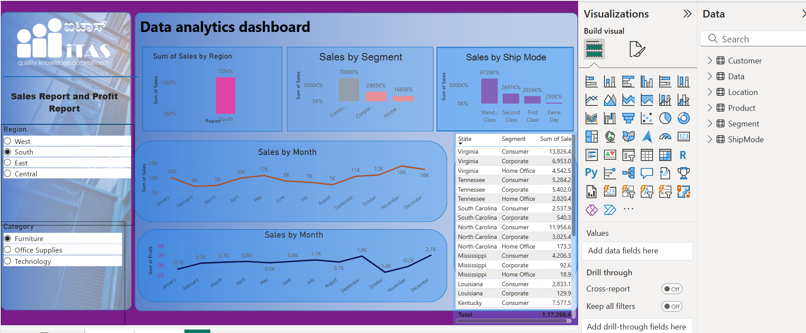

# Sales Analysis Dashboard (Power BI)

## 📊 Project Overview
This project focuses on analyzing sales data using **Microsoft Power BI** to gain meaningful business insights. The dashboard helps understand sales trends, regional performance, customer segments, and shipping modes.

## 📊 Dashboard Preview

## 🎯 Objectives
- Analyze overall sales performance
- Identify monthly sales trends
- Compare sales by region and customer segment
- Evaluate shipping mode impact on sales
- Support data-driven business decisions

## 🛠 Tools & Technologies
- Microsoft Power BI
- Data Modeling
- DAX Measures
- Interactive Visualizations

## 📈 Dashboard Features
- Sales by Month (trend analysis)
- Sales by Region
- Sales by Customer Segment
- Sales by Ship Mode
- KPI cards for quick insights

## 📁 Files Included
- `Sales_Analysis.pbix` – Power BI dashboard file

## 📌 Key Insights
- Clear visibility of monthly sales growth and decline
- Identification of top-performing regions and segments
- Better understanding of customer preferences

## 👤 Author
**Nayan**
